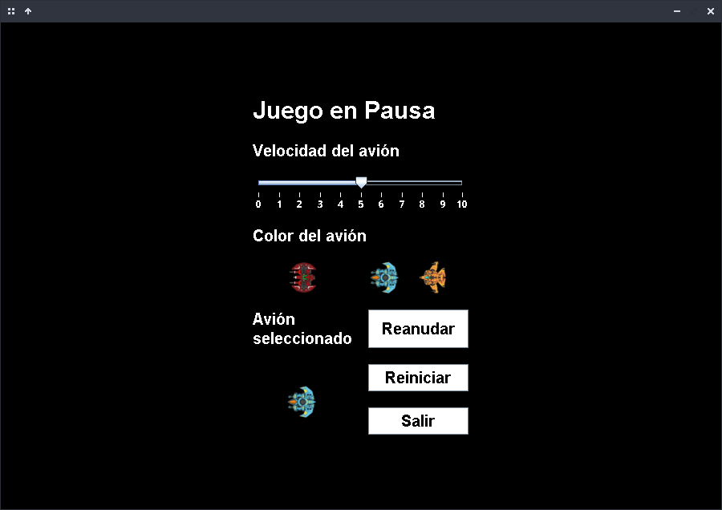
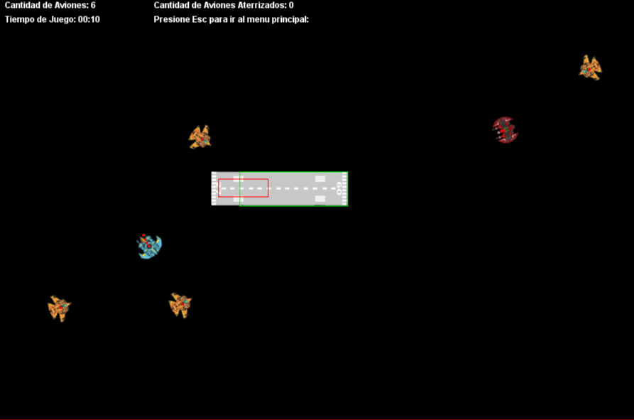

# Air-Trafic-Control
Air Traffic Control game where players control airplanes using the mouse to land them on a runway. Built in Java Swing, the project follows the MVP architecture, leveraging multithreading and concurrency for enhanced performance and realism.

Game images: 

